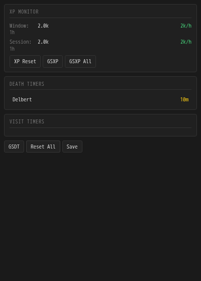

# Being's Discworld XP Timers

Track Discworld hotspot death and visit timers alongside XP gains and hourly rates.

Requires Mallard 0.27.0 or later; targets Discworld. Install through the marketplace or import the `.mallardx` archive.

Use `/dt help` for commands. `/dt` lists hotspot timers, `/xpreport` shows XP rates, and `/gsdt` and `/gsxp` share reports.

## Permissions

Sends game commands and group reports. Reads the GMCP packages declared in `plugin.toml`. Stores state in per-world plugin storage. No external network access.

## Development

Run `python3 -m unittest discover -s tests -v` (requires Lua 5.4 shared library). Panel tests require Python Playwright and Chromium. Build with `python3 scripts/build.py`; the reproducible archive includes only the manifest, license, README, runtime source, panel files, and assets.

